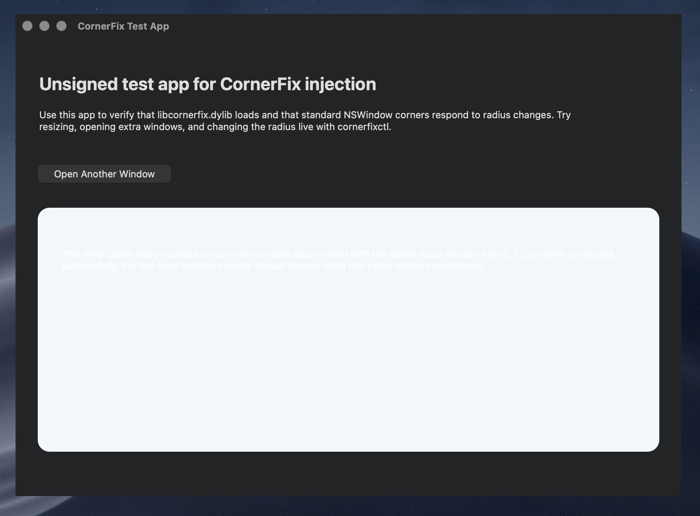

# CornerFix

`CornerFix` is now an injected macOS window sharpener instead of the old display-overlay experiment.

The previous version only drew caps over the edges of the display, which did not actually change application window corners. This rewrite follows the same broad model as `apple-sharpener`: a small injected dynamic library runs inside target apps and forces standard windows to use a configurable corner radius, while a CLI updates shared settings live through Darwin notifications.

## Screenshot



## What It Does

- Forces ordinary titled app windows toward square corners
- Supports live enable/disable without app restarts
- Supports live radius changes from `0...24`
- Supports per-app overrides keyed by bundle identifier
- Supports presets, reset, reload, and config listing from the CLI
- Avoids most obvious system UI by filtering special window classes and non-normal window levels
- Falls back to `0` radius in fullscreen mode to reduce visual artifacts

## Project Layout

- `src/sharpener/CornerFixSharpener.m`: injected library entry point and runtime hooks
- `src/sharpener/CFXSwizzle.m`: minimal method-swizzling helper
- `src/common/CFXShared.*`: shared preference and Darwin-notification helpers
- `src/cli/main.m`: `cornerfixctl` command-line controller
- `src/inject/main.m`: `cornerfix-inject` launch-based injector
- `src/testapp/`: unsigned local Cocoa app for payload validation
- `examples/`: example command workflows
- `scripts/install.sh`, `scripts/uninstall.sh`: install tooling
- `LOADER.md`: loader integration notes
- `COMPATIBILITY.md`: compatibility test matrix
- `libcornerfix.dylib.blacklist`: example processes to avoid injecting

## Build

```bash
make
make install
```

Artifacts:

- `build/libcornerfix.dylib`
- `build/cornerfixctl`
- `build/cornerfix-inject`
- `build/CornerFixTestApp.app`

## Usage

Build first, then inject `build/libcornerfix.dylib` with `build/cornerfix-inject` or your preferred loader/tweak framework.

Examples:

```bash
./build/cornerfix-inject --app ./build/CornerFixTestApp.app
./build/cornerfix-inject --app ./build/CornerFixTestApp.app --check
./build/cornerfix-inject --bundle-id com.apple.TextEdit
./build/cornerfixctl on
./build/cornerfixctl off
./build/cornerfixctl toggle
./build/cornerfixctl --radius 0
./build/cornerfixctl --preset soft
./build/cornerfixctl --app com.apple.Safari --radius 0
./build/cornerfixctl list
./build/cornerfixctl config-path
./build/cornerfixctl effective-config
./build/cornerfixctl --app com.apple.Safari effective-config
./build/cornerfixctl doctor
./build/cornerfixctl reload
./build/cornerfixctl --status
```

More CLI details: [CLI.md](CLI.md)
Loader notes: [LOADER.md](LOADER.md)
Compatibility matrix: [COMPATIBILITY.md](COMPATIBILITY.md)
Testing guide: [TESTING.md](TESTING.md)

Example workflows:

- [examples/basic-workflow.sh](examples/basic-workflow.sh)
- [examples/ammonia-style-usage.sh](examples/ammonia-style-usage.sh)
- [examples/per-app-overrides.sh](examples/per-app-overrides.sh)
- [examples/reset-and-reload.sh](examples/reset-and-reload.sh)
- [examples/testapp-injection.sh](examples/testapp-injection.sh)

## Install / Uninstall

Default install prefix is `/usr/local`.

```bash
make install
make uninstall
```

You can override the destination:

```bash
make install PREFIX=/opt/cornerfix
```

For local testing in restricted environments, you can override the settings plist path:

```bash
CFX_SETTINGS_PATH=/tmp/cornerfix-settings.plist ./build/cornerfixctl list
```

## Injection Notes

This project is designed for an injection-based workflow similar to Ammonia-style tweaks. It is not a sandboxed App Store style app, and it is not SIP-safe in the same sense as the old overlay approach.

If you plan to load it broadly across apps, you should:

- use a loader that supports process blacklists
- avoid injecting into system daemons and shell infrastructure
- test on a secondary machine or non-critical install first

## Limitations

- macOS private window internals change between releases, so view-hierarchy targeting may need updates
- some apps use custom rendering paths and may not respond cleanly
- no claim is made that this is safe for production machines with strict macOS security enabled

## Future Updates

Planned hardening and feature work:

- tighten settings-file permissions and ownership checks for the shared plist
- add an optional validation token or similar guard for live reload signaling
- improve install-time path validation and safety checks
- narrow default injection targets and expand blacklist handling
- document a clearer security model and operational risks
- add richer per-app tools such as import/export of override profiles
- add diagnostics commands for active config path, effective app settings, and loader troubleshooting
- add optional debug logging controls for window matching and hook application

## License

MIT
